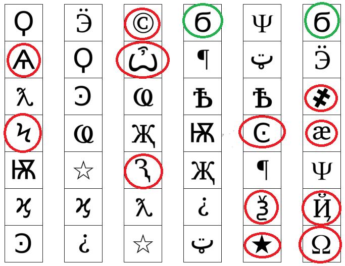
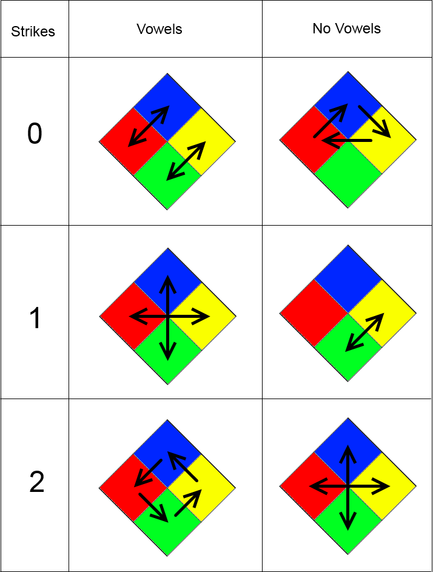
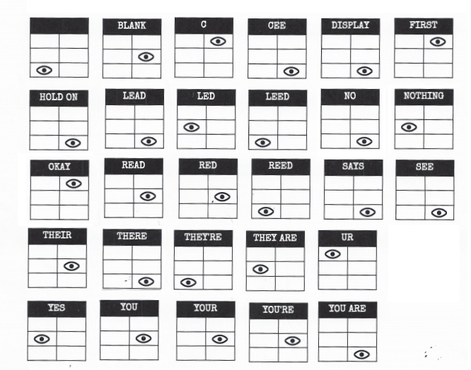
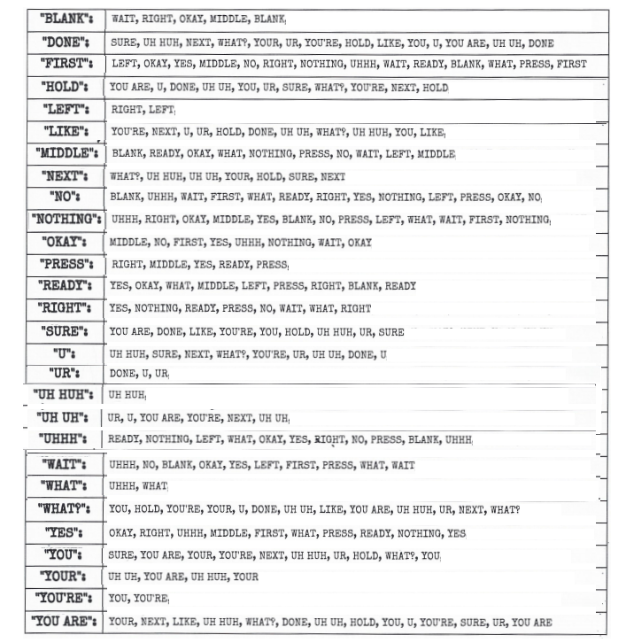
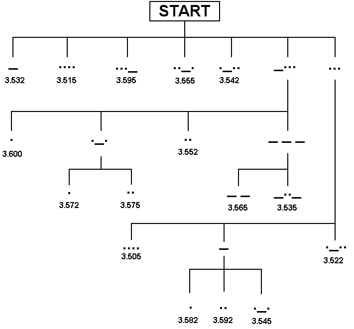
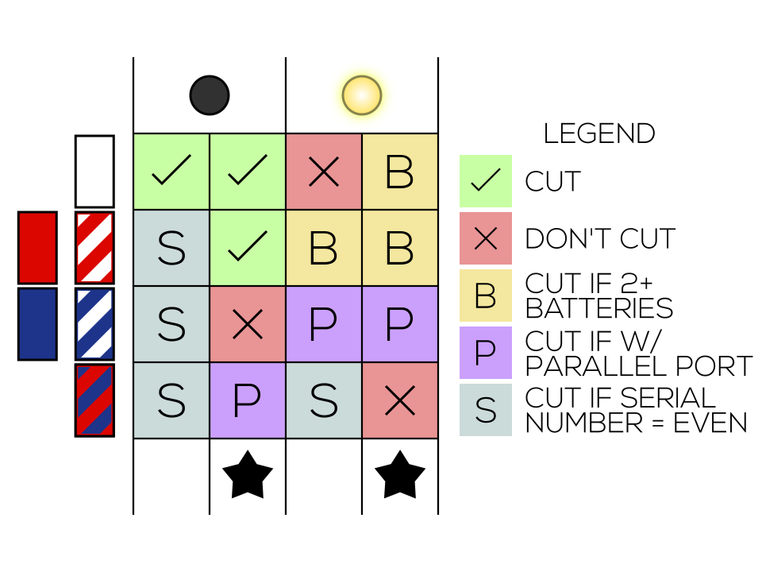
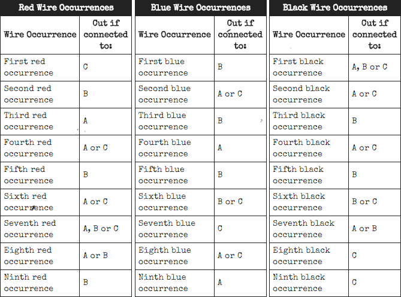
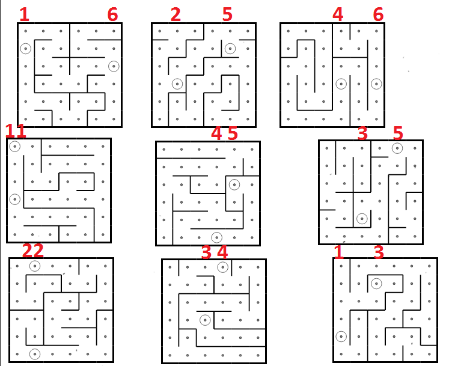
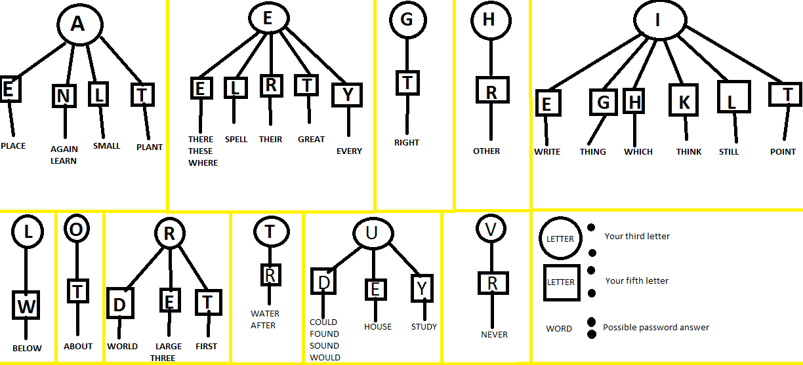

## Wires
SN is the last number of Serial number.

**3 Wires**  
No Red - 2nd  
2+ Blue & Last not White - Last Blue  
Otherwise - Last  

**4 Wires**  
2+ Red & SN odd - Last Red  
No Red & Last Yellow - 1st  
1 Blue - 1st  
2+ Yellow - Last  
Otherwise - 2nd  

**5 Wires**  
Last Black & SN odd - 4th  
No Black or Red - 2nd  
Otherwise - 1st  

**6 Wires**  
No Yellow & SN odd - 3rd  
1 Yellow & 2+ White - 4th  
No Red - Last  
Otherwise - 4th  

## Buttons
Blue & Abort - Hold  
2+ Battery & Detonate - Release  
White & CAR lit - Hold  
3+ Battery & FRK lit - Release  
Red & Hold - Release  

Blue - 4  
Yellow - 5  
Other - 1  

## Keypads

## Simon Says

## Who's on First

## Memory
**Stage 1**  
1: Position 2  
2: Position 2  
3: Position 3  
4: Position 4  

**Stage 2**  
1: Number 4  
2: Same position as Stage 1  
3: Position 1  
4: Same position as Stage 1  

**Stage 3**  
1: Same number as Stage 2  
2: Same number as Stage 1  
3: Position 3  
4: Number 4  

**Stage 4**  
1: Same position as Stage 1  
2: Position 1  
3: Same position as Stage 2  
4: Same position as Stage 2  

**Stage 5**  
1: Same number as Stage 1  
2: Same number as Stage 2  
3: Same number as Stage 4  
4: Same number as Stage 3  

## Morse Code

## Complicated Wires

## Wire Sequence
[https://ktane.timwi.de/HTML/Wire%20Sequence.html](https://ktane.timwi.de/HTML/Wire%20Sequence.html) Mark with Shift+Click

## Maze

## Password

## Needys

### Venting Gas
Detonate - N  
Vent Gas - Y

### Capacitor Discharger
Pull the lever down

### Knobs
UP: 3-6 or 3-5  
DOWN: 2-3-6 or 0 (No double LEDs)  
LEFT: 5  
RIGHT: 1-3-5 or 1-3  